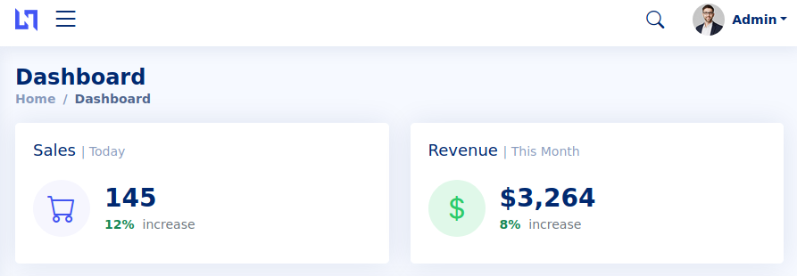
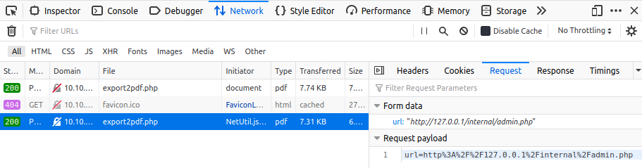
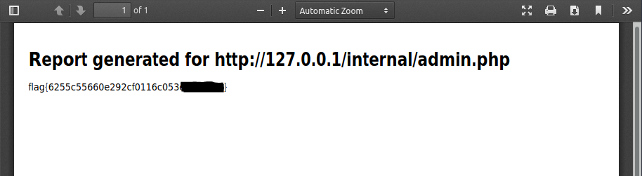

<div style="text-align:center;">

</div>

Let's visit the web page and start the usual enumeration phase. Let's read the content of `robots.txt`

```
User-Agent: *
Disallow: /backup/chat.txt
```

Below the file content

```
Admin: I have finished setting up the new export2pdf tool.
Kate: Thanks, we will require daily system reports in pdf format.
Admin: Yes, I am updated about that.
Kate: Have you finished adding the internal server.
Admin: Yes, it should be serving flag from now.
Kate: Also Don't forget to change the creds, plz stop using your username as password.
Kate: Hello.. ?
```

We can guess the admin credentials. Let's try to log in with them



We are in. Scrolling down the dashboard page, we can see two things:
- A blue button saying "Export to PDF"
- `/internal/admin.php` contains the flag

The button, when clicked generates a PDF file with some host information. Looking at the request from the network browser tab we can see a POST request to `/server-info.php` with the following parameter

```
url=http%3A%2F%2F127.0.0.1%2Fserver-info.php
```

We can assume that the application is vulnerable to SSRF. Let's try to edit the request's parameter with 

```
url=http%3A%2F%2F127.0.0.1%2Finternal%2Fadmin.php
```

and resend it 



Double click it to open the response PDF

